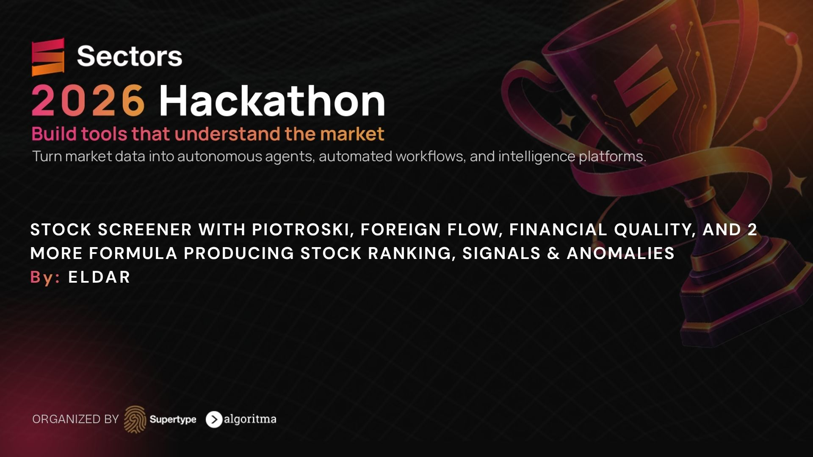

# Eldar

A screener for the Indonesia Stock Exchange. It ranks the listed universe with a score you can open, attaches a reason to every signal and unusual-activity flag, and puts two or three names side by side.

Built for the [Sectors Hackathon 2026](https://hackathon.sectors.app/), Market Intelligence track. The interface is in English and Indonesian.

Company data, fundamentals, foreign flow, filings, and screener tags come from the [Sectors Financial API](https://sectors.app/api) v2. Yahoo Finance supplies price and volume history. Removing Sectors removes the universe the score, the signals, and the flags are built on.

**Information and analysis only. Not investment advice.**

<p align="center">
  
</p>

## Watch

| | |
| --- | --- |
| **[Deep dive · 3 minutes](https://www.youtube.com/watch?v=21vUAqFipe4)** | **[Teaser · 1 minute](https://www.youtube.com/watch?v=ZbbdBzn65H8)** |
| How Discover, a stock brief, Compare, and unusual activity fit together. | The same product, in one minute. |

## What you can do

- **Discover** (`/`) searches the Indonesian universe by ticker, company, sector, subsector, signal, and minimum score. Sort by the overall score, or by quality, value, momentum, or foreign flow. The Jakarta Composite (IHSG) session sits above the table.
- **A stock brief** (`/stock/BBCA`) shows the universe rank, the four pillars, the tests behind each method, any signals, and a price chart. Each number links back to the input it came from.
- **Compare** (`/compare`) places two or three tickers in columns: scores, signals, and unusual-activity flags.
- **Unusual activity** (`/unusual`) lists sessions that stand out. Volume is compared with that stock’s own history. Foreign flow is compared with other stocks on the same day.

## How a stock earns its score

The overall score is a weighted average of the pillars that can be computed. Default weights:

| Pillar | Weight | Method |
| --- | ---: | --- |
| Quality | 30 | Piotroski F-score. Banks and other financials use Financial Quality. |
| Value | 25 | Magic Formula, then re-ranked among sector peers. |
| Momentum | 25 | 12–1 return. |
| Foreign flow | 20 | Net foreign buying relative to foreign turnover. |

A missing pillar is dropped and the remaining weights are rescaled. Fewer than three pillars leaves the stock unranked. Weights can be overridden on `GET /api/scores`.

Before ranking, the screener sets aside suspended names, the Watchlist board, and names below Rp 100 billion in market cap. When a Yahoo average traded value is present, names below Rp 100 million are set aside as well. Banks stay in the universe.

`GET /api/scores` and `GET /api/scores/{symbol}` read the local snapshot. They do not call Sectors.

### Quality — Piotroski F-score

Nine yes-or-no tests against the prior fiscal year (Piotroski 2000, *Journal of Accounting Research*):

1. ROA > 0
2. Cash flow from operations > 0
3. ROA higher than the prior year
4. Cash flow from operations > net income
5. Lower long-term debt ratio
6. Higher current ratio
7. No new shares issued
8. Higher gross margin
9. Higher asset turnover

The score is the pass count, scaled from 0–9 to 0–100. Fewer than six computable tests leaves the pillar empty. Financial companies skip this checklist.

### Quality — financials

Banks and other financials are ranked against other financials on return on equity, net interest margin (higher is better), and non-performing loans (lower is better). In the current snapshot, ROE is often the only one of the three present, and it carries the pillar.

### Value — Magic Formula

Earnings yield and return on capital are ranked, the ranks are added, and the sum becomes a percentile where 100 is best (Greenblatt 2005, *The Little Book That Beats the Market*).

The published inputs are earnings yield = EBIT / enterprise value and return on capital = EBIT / (net working capital + net fixed assets). This snapshot does not carry those fields, so earnings yield is `1 / pe_ttm` and return on capital is `roe_ttm`. A non-positive P/E is treated as the worst earnings yield.

Financials, utilities, suspended names, and names below the liquidity floors are excluded. When a sector has at least eight scored peers, the value pillar is re-ranked inside that sector.

### Momentum — 12–1

Return from twelve months ago to one month ago:

```text
(1 + return_12m) / (1 + return_1m) − 1
```

That return is percentile-ranked across the universe. The twelve- and one-month changes come from a Yahoo Finance price overlay when the Sectors snapshot has no history of its own. If that history is missing too, the pillar falls back to the daily close change in the snapshot. The stock page says which series was used.

### Foreign flow

Net foreign buying divided by foreign turnover (weight 0.7), combined with that stock’s turnover relative to the universe median (weight 0.3), then percentile-ranked. A higher score means stronger net foreign buying relative to the rest of the universe.

This is a strength score. The unusual-activity flag below is a separate standard score on the same Sectors flow data.

## Signals

Each badge on a row carries the rule that fired.

| Badge | Rule |
| --- | --- |
| Price mover | Absolute daily close change of at least 5%, from the Sectors universe snapshot. |
| 52-week high | The Sectors `52-w-high` tag, or a close within 2% of the 52-week high on the Yahoo overlay. |
| Foreign accumulation | Net foreign inflow of at least Rp 1 billion and at least 15% of foreign turnover, on the latest cached flow day. |
| Insider buying | An insider buy in the cached Sectors filings window. |

Filter the table in the app, or call `GET /api/screener?signal_filter=mover`.

## Unusual activity

`GET /api/unusual` flags two standard scores. Both are computed from the local snapshot.

**Volume.** The latest session is compared with that symbol’s own trailing 60 sessions. The latest session is left out of the baseline, so a spike cannot inflate the average it is measured against. A flag needs at least 30 baseline sessions and a non-zero deviation, and it fires at **3 standard deviations**. Volume history is the Yahoo overlay.

**Foreign flow.** Net foreign inflow is divided by the stock’s 20-session average traded value. That multiple is then scored across the IDX cross-section with a median and a median absolute deviation (scaled by 1.4826). A flag fires at **8 standard deviations**, and only when net flow is at least Rp 1 billion.

Two properties of the snapshot shape those rules:

- The cache holds one Sectors foreign-flow day, so the flow score compares a stock with the rest of the market that day. A history per symbol would mean one `GET /v2/foreign-flow/{symbol}/` call per ticker.
- Net flow divided by foreign turnover is bounded between −1 and 1, so it cannot reach a multi-sigma flag. The traded-value multiple is unbounded, which is why that is the measured quantity. The cross-section is fat-tailed, which is why the cut sits at 8 standard deviations rather than 3.

```text
GET /api/unusual
GET /api/unusual?anomaly_kind=volume_standard_score
GET /api/unusual?min_standard_score=10
GET /api/screener?anomaly_only=true
```

## A query of your own

`GET /api/screener/custom` forwards a structured `where` clause to the Sectors screener. One page is up to 200 rows and costs **1 credit**. The same clause already in the local HTTP cache costs **0**. The client does not send a natural-language `q=` query.

The clause is checked locally first: field names against the documented screener list, yearly fields as `revenue[2024]`, quarterly fields as `revenue_q[Q1-2024]`, balanced quotes and brackets, at most 400 characters, and at most 10 comparisons. A clause rejected locally returns 422 and costs nothing. A clause Sectors rejects is a structured 400, which is also unbilled.

Matches that exist in the snapshot come back with their score, signals, and anomaly flags. Matches outside the snapshot come back with an empty score.

```text
GET /api/screener/custom/fields
GET /api/screener/custom?where=market_cap > 10000000000000&dry_run=true
GET /api/screener/custom?where=sector = 'Financials' and roe_ttm > 0.15
GET /api/screener/custom?where=tags in ['52-w-high'] and yield_ttm > 0.03
```

`dry_run=true` reports the planned cost and does not call Sectors. `GET /api/screener` stays on the snapshot, so the billable path is the `/custom` route.

## Data and credits

Sectors responses are cached in SQLite (`backend/data/sectors.db`, gitignored) and in a local HTTP cache. `GET /api/credits` is the running counter. Backend logs print `credits=+N used=… remaining=…` after every Sectors call.

| Call | Cost |
| --- | --- |
| Structured screener page, up to 200 rows | 1 credit. A cached page is 0. |
| Full-universe foreign flow, up to 30 rows per page | 1 credit per page. |
| Insider filings page, up to 30 rows | 1 credit per page. |
| `52-w-high` tag query | 1 credit per page. |
| Score, signals from the snapshot, unusual activity | 0. |
| Yahoo Finance overlay | 0 Sectors credits. |

The first `/api` request of each Jakarta day refreshes the snapshot in the background: company universe, foreign flow, the 52-week-high tag, insider filings, and a recent IHSG window. That refresh is planned at **33 credits** and stops at a cap of **45**. The Yahoo overlay runs in the same job. Set `DAILY_REFRESH_ENABLED=false` in `.env` when you want the server to stay on the snapshot you already have.

To build the snapshot by hand:

```bash
cd backend
source .venv/bin/activate
python -m app.sectors.snapshot --dry-run
python -m app.sectors.snapshot --max-credits 50
python -m app.sectors.signals_snapshot --max-credits 8
PYTHONPATH=. python ../scripts/enrich_yahoo.py
```

`--dry-run` prints the planned spend. Reruns hit the cache. `--force` spends the credits again.

## Stack

- Backend: Python, FastAPI (`backend/`)
- Frontend: SvelteKit, Svelte 5, TypeScript, Tailwind (`frontend/`)
- Store: SQLite
- Market data: Sectors API v2 (`https://api.sectors.app/v2`), key in the `Authorization` header

The app’s response shapes live in `backend/app/models/`. The frontend talks only to `/api`.

## Run it locally

1. Copy `.env.example` to `.env` and set `SECTORS_API_KEY`. Get a key at [sectors.app/api](https://sectors.app/api).

2. Backend, from `backend/`:

```bash
python3 -m venv .venv
source .venv/bin/activate
pip install -r requirements.txt
uvicorn app.main:app --reload --app-dir .
```

The API listens on `http://127.0.0.1:8000`. `GET /health` returns `ok`.

3. Frontend, from `frontend/`:

```bash
npm install
npm run dev
```

Open `http://localhost:5173`. The dev server proxies `/api` to the backend.

4. Load a snapshot with the commands in [Data and credits](#data-and-credits). The database is not in git, so a fresh clone has no universe until that step finishes.

```bash
cd backend && PYTHONPATH=. pytest
```

## Routes

| Route | What it returns |
| --- | --- |
| `GET /api/screener` | Snapshot rows with score, signals, and anomaly flags. |
| `GET /api/screener/custom` | One validated Sectors `where` page. |
| `GET /api/stocks/{symbol}` | Research brief for one ticker. |
| `GET /api/scores` | Universe scores. Optional `quality`, `value`, `momentum`, and `flow` weights. |
| `GET /api/scores/{symbol}` | One ticker scored against the universe. |
| `GET /api/unusual` | Volume and foreign-flow flags. |
| `GET /api/market/ihsg` | Latest IHSG session. |
| `GET /api/credits` | Credits used and remaining. |

---

Information and analysis only. Not investment advice. Eldar does not place orders and does not connect to a brokerage.
